# Chapter 9: Graph Algorithms
*Data Structures and Algorithmic Thinking with Python*

---

## 9.1 Introduction

In the real world, many problems are represented in terms of objects and connections between them. For example, in an airline route map, we might be interested in questions like: "What's the fastest way to go from Hyderabad to New York?" or "What is the cheapest way to go from Hyderabad to New York?" To answer these questions we need information about connections (airline routes) between objects (towns).

Graphs are data structures used for solving these kinds of problems.

As part of this chapter, you will learn several ways to traverse graphs and how you can do useful things while traversing the graph in some order. We will also talk about shortest paths algorithms. We will finish with minimum spanning trees, which are used to plan road, telephone, and computer networks and also find applications in clustering and approximate algorithms.

---

## 9.2 Glossary

**Graph:** A graph G is simply a way of encoding pairwise relationships among a set of objects: it consists of a collection V of nodes and a collection E of edges, each of which "joins" two of the nodes. We thus represent an edge e in E as a two-element subset of V: e = {u, v} for some u, v in V, where we call u and v the ends of e.

Edges in a graph indicate a symmetric relationship between their ends. Often we want to encode asymmetric relationships, and for this, we use the closely related notion of a directed graph. A directed graph G' consists of a set of nodes V and a set of directed edges E'. Each e' in E' is an ordered pair (u, v); in other words, the roles of u and v are not interchangeable, and we call u the tail of the edge and v the head. We will also say that edge e' leaves node u and enters node v.

When we want to emphasize that the graph we are considering is *not directed*, we will call it an *undirected graph*; by default, however, the term "graph" will mean an undirected graph. It is also worth mentioning two warnings in our use of graph terminology. First, although an edge e in an undirected graph should properly be written as a set of nodes {u, u}, one will more often see it written in the notation used for ordered pairs: e = (u, v). Second, a node in a graph is also frequently called a vertex; in this context, the two words have exactly the same meaning.

- *Vertices* and *edges* are positions and store elements
- Definitions that we use:

### Directed edge
- Ordered pair of vertices (u, v)
- First vertex u is the origin
- Second vertex v is the destination
- Example: one-way road traffic

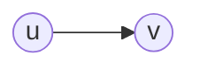

### Undirected edge
- Unordered pair of vertices (u, v)
- Example: railway lines

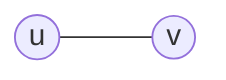

### Directed graph
- All the edges are directed
- Example: route network

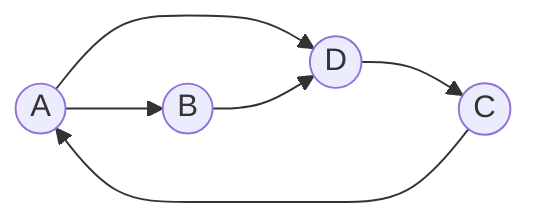

### Undirected graph
- All the edges are undirected

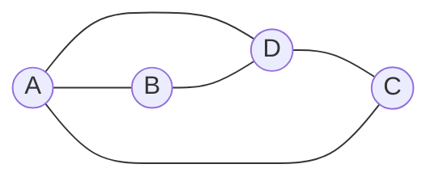

---

### Weighted graphs

In *weighted graphs* integers (weights) are assigned to each edge to represent (distances or costs).

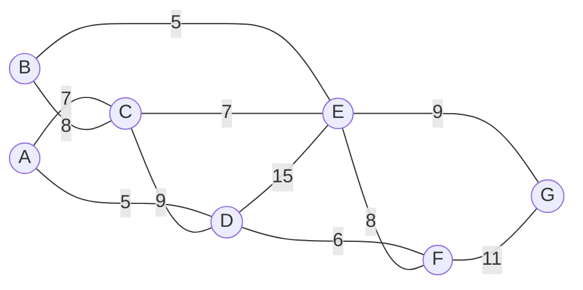

- In addition to simply knowing about the existence of a path between some pair of nodes u and v, we may also want to know whether there is a short path. Thus we define the **distance** between two nodes u and v to be the minimum number of edges in a u-v path.
- A **forest** is a disjoint set of trees.
- A **spanning tree** of a connected graph is a subgraph that contains all of that graph's vertices and is a single tree. A spanning forest of a graph is the union of spanning trees of its connected components.
- A **bipartite graph** is a graph whose vertices can be divided into two sets such that all edges connect a vertex in one set with a vertex in the other set.

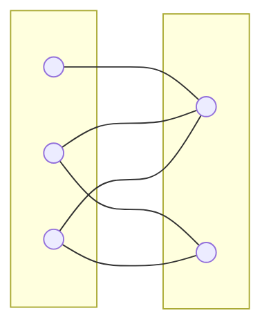

- Graphs with all edges present are called **complete graphs**.

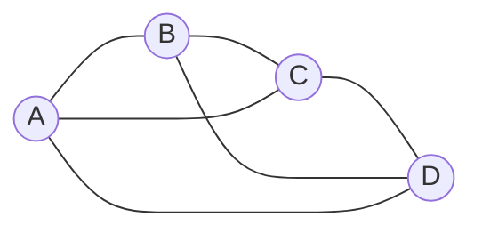

- Graphs with relatively few edges (generally if edges < |V| log|V|) are called **sparse graphs**.
- Graphs with relatively few of the possible edges missing are called **dense graphs**.
- Directed weighted graphs are sometimes called a **network**.
- We will denote the number of vertices in a given graph by |V|, and the number of edges by |E|. Note that E can range anywhere from 0 to |V|(|V|−1)/2 (in an undirected graph). This is because each node can connect to every other node.

---

## 9.3 Applications of Graphs

- Representing relationships between components in electronic circuits
- Transportation networks: Highway network, Flight network
- Computer networks: Local area network, Internet, Web
- Databases: For representing ER (Entity Relationship) diagrams in databases, for representing dependency of tables in databases

---

## 9.4 Graph Representation

As in other ADTs, to manipulate graphs we need to represent them in some useful form. There are several ways to represent graphs, each with its advantages and disadvantages. Some situations, or algorithms that we want to run with graphs as input, call for one representation, and others call for a different representation. Here, we'll see three ways to represent graphs:

- Adjacency Matrix
- Adjacency List
- Adjacency Set

---

## Example: Flight Network

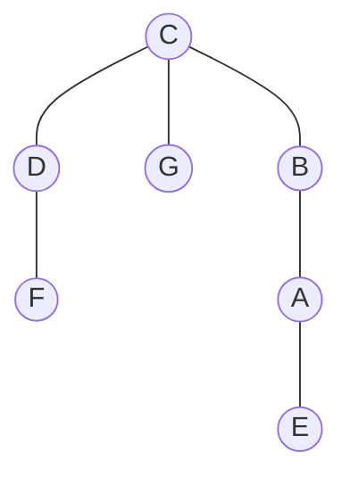

- When an edge connects two vertices, the vertices are said to be **adjacent** to each other and the edge is **incident** on both vertices.
- A graph with no cycles is called a **tree**. A tree is an acyclic connected graph.

- A **self loop** is an edge that connects a vertex to itself.

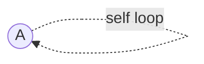

- Two edges are **parallel** if they connect the same pair of vertices.

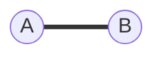

- The **degree** of a vertex is the number of edges incident on it.
- A **subgraph** is a subset of a graph's edges (with associated vertices) that form a graph.

### Paths

One of the fundamental operations in a graph is that of traversing a sequence of nodes connected by edges. We define a **path** in an undirected graph G = (V, E) to be a sequence P of nodes v₁, v₂, ..., v_{k-1}, v_k with the property that each consecutive pair vᵢ, v_{i+1} is joined by an edge in G. P is often called a path from v₁ to v_k, or a v₁-v_k path.

A path is called **simple** if all its vertices are distinct from one another. A **cycle** is a path v₁, v₂, ..., v_{k-1}, v_k in which k > 2, the first k − 1 nodes are all distinct, and v₁ = v_k. In other words, the sequence of nodes "cycles back" to where it began. All of these definitions carry over naturally to directed graphs, with the following change: in a directed path or cycle, each pair of consecutive nodes has the property that (vᵢ, v_{i+1}) is an edge. In other words, the sequence of nodes in the path or cycle must respect the directionality of edges.

- A **path** in a graph is a sequence of adjacent vertices. **Simple path** is a path with no repeated vertices. In the graph below, the dotted lines represent a path from G to E.

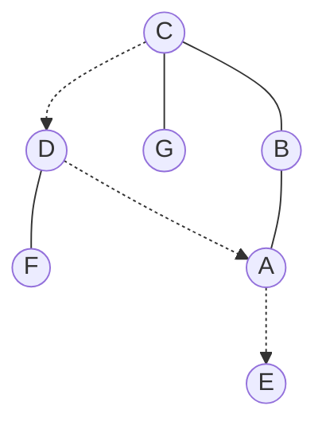

- A **cycle** is a path where the first and last vertices are the same. A **simple cycle** is a cycle with no repeated vertices or edges (except the first and last vertices).

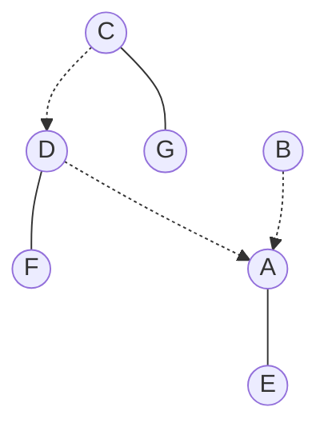

### Connectivity

We say that an undirected graph is **connected** if, for every pair of nodes u and v, there is a path from u to v. Choosing how to define connectivity of a directed graph is a bit more subtle, since it's possible for u to have a path to v while v has no path to u. We say that a directed graph is **strongly connected** if, for every two nodes u and v, there is a path from u to v and a path from v to u.

- We say that one vertex is **connected** to another if there is a path that contains both of them.
- A graph is **connected** if there is a path from every vertex to every other vertex.
- If a graph is not connected then it consists of a set of **connected components**.

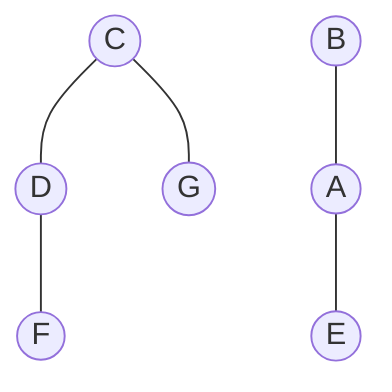
*(Two connected components: {C, D, F, G} and {B, A, E})*

- A **directed acyclic graph (DAG)** is a directed graph with no cycles.

---

*Source: pages 214–215, sections 9.1–9.4, "Data Structures and Algorithmic Thinking with Python"*
