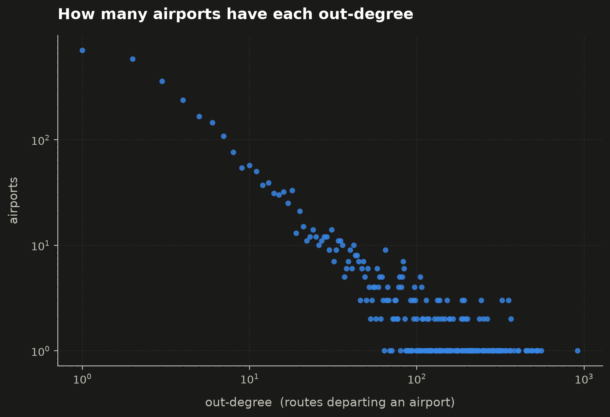
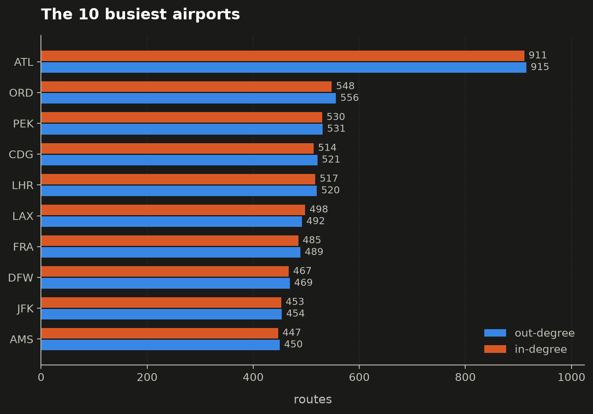
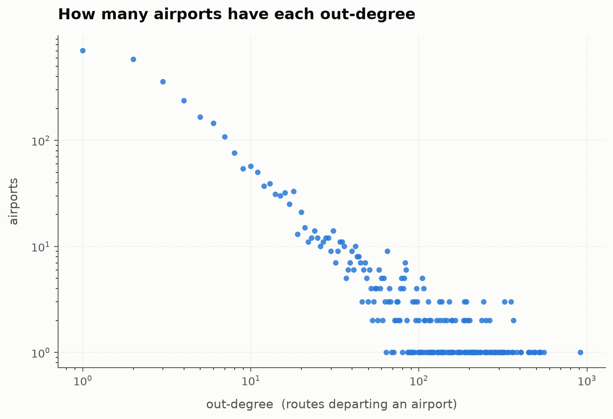
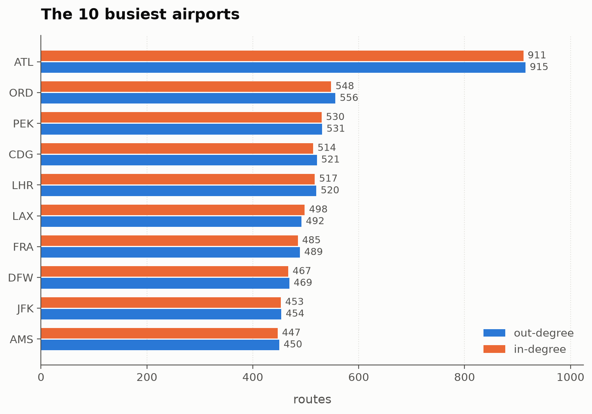

# 2. Dataset

## 2.1 Data sources

The project catalog identified one source — OpenFlights airports and routes — and we
used two. The edges come from OpenFlights `routes.dat`, which is the only open
table of scheduled airline service at this scale. The vertices come from
**OurAirports** instead of OpenFlights' own `airports.dat`, because the edges
are the harder half and the airports have to be good enough to resolve them.

| Source | Raw rows | What we take from it |
|---|---|---|
| OurAirports `airports.csv` | 85,884 | Airport identity, coordinates, and the descriptive columns |
| OpenFlights `routes.dat` | 67,663 | Airline, origin, destination, codeshare flag, stops, equipment |
| Wikipedia list of international airports | 1,329 airports | The `is_international` flag |

- OpenFlights `airports.dat` carries 14 fields for 7,698 airports

- OurAirports carries 85,884 rows and adds:
    - `iso_region`
    - `iso_country`
    - `continent`
    - `scheduled_service`
    - `type`
    - `wikipedia_link`

The field `type` and `iso_country` proved useful given that `type` categorized
airports as *small*, *medium*, and *large*; `iso_country` is an ISO code rather
than a free-text name. Each of these fields were useful to narrow an analysis
to a smaller data set.

An additional column, `is_international`, comes from a scrape of
Wikipedia's list of international airports, and marks 1,329 of the 3,387
as recognized international airports.

### Two sources, because the edges are the harder half

Out-degree, log–log. **38.4% of airports have two or fewer departures**; ATL (Atlanta) has 915. Mean 19.6 against a median of 4 — the gap *is* the shape of the network.

The ten busiest airports, in- and out-degree. ATL (Atlanta) 915/911, AMS (Amsterdam) 450/447 — in- and out-degree track each other at every hub. The ten alone carry **8.1%** of all routes.

Where it comes from

### 85,884 vertices, 67,663 edges

**OurAirports** for the airports, not OpenFlights' own `airports.dat` — it
carries `type` and `iso_country`, which are the columns every narrowing in
this project filters on.

**OpenFlights `routes.dat`** for the routes: the only open table of scheduled
service at this scale.

What it becomes

### 3,387 airports, 66,332 routes

Sparse — **0.32%** of the 11,468,382 ordered pairs a complete digraph would
have. 98.0% of airports sit in one strongly connected core, which is why a
long-haul query is real search rather than "no route".

## 2.2 Scope

After cleaning the raw data our whole world airline network consisted of
**3,387 airports and 66,332 routes** which is measured in §2.5, not
estimated.

Every experiment that was run for this project was against frozen **snapshot**
that included a checksum to avoid drift.

A snapshot is the two cleaned CSVs: *airports.csv* and *routes.csv* that are filtered
on for example an `iso_country` or the aformentioned `type` which describes the size of 
an airport, with larger airports typically having the larger number of routes.
To ensure integrity of the files each files SHA-256 is recorded, such that
successive runs of the same experiment can detect if the data has been altered
from previous runs of the same experiment

## 2.3 Cleaning and preparation

* **Airports:** Reduced from 85,884 raw records to 3,387 retained nodes. Data was
filtered by requiring a valid IATA code (discarding 76,831 non-commercial entries)
and connection to at least one active route (discarding 5,666 unused airports).

* **Routes:** Reduced from 67,663 raw records to 66,332 retained edges. Rows were discarded (1,331 total) whenever either the origin (663), destination (660), or both (8) failed to resolve to a valid retained airport.

### Cleaning: what got dropped, and why

Airports

### 85,884 → 9,053 → 3,387

Usable means three IATA characters and both coordinates. Of the survivors, only
those a **surviving route actually touches** are written out.

Routes

### 67,663 → 66,332

**1,331 dropped** — both endpoints must resolve. 663 origin, 660 destination,
8 neither. The near-symmetry says *missing airports*, not directional bias.

Not silent

### Every drop is a `(row, reason)` pair

A cleaning step that cannot say what it removed is indistinguishable from a
bug.

## 2.4 What a cleaned route is, and is not

Two caveats qualify every number that follows:

First, *a route is a marketed airline service, not a distinct physical flight*.
Of the 66,332 routes across 36,717 airport pairs, 29,615 run parallel to another (§2.5). While 564 carriers suggest competition, 11,982 of the 45,754 duplicated route rows are simply codeshares—the same aircraft marketed under different carrier codes (e.g., ORD→ATL accounts for 20 rows). Consequently, the network is a multigraph of marketing offers, and the shortest-path algorithms treat these parallel edges as equivalent alternatives of identical length.

Second, eleven rows have stops > 0, meaning a tiny fraction of routes are not nonstop. Edge weights use great-circle distance regardless, which slightly understates these specific journeys. However, representing just 0.017% of the dataset, they do not alter any findings in §7; they are noted upfront simply to keep the analysis rigorous.

## 2.5 Basic graph statistics

**Size and Density**

* **Cleaned Network Totals:** 3,387 airports and 66,332 routes.
* **Distinct Airport Pairs:** 36,717 distinct pairs (collapsing parallel routes).
* **Parallel Routes:** 29,615 routes (45% of the total table) run parallel to another route on the same airport pair.
* **Directed City Pairs:** 36,717 ordered pairs (e.g., ATL→ORD and ORD→ATL are counted separately).
* **Undirected City Pairs:** 18,814 unique city pairs (collapsing directionality).
* **Bi-directional Pairs:** 17,903 city pairs are served in both directions.
* **One-way Pairs:** 911 city pairs (4.8% of total city pairs) are served in one direction only.
* **Graph Sparsity:** Uses 0.32% of all possible 11,468,382 directed pairs (more than 99.6% sparse).

**Degree Statistics**

* **Out-degree Range:** Minimum 0 | Median 4 | Mean 19.6 | Maximum 915 (ATL)
* **In-degree Range:** Minimum 0 | Median 4 | Mean 19.6 | Maximum 911 (ATL)
* **Low-Volume Airports:** 38.4% of airports have 2 or fewer departures.
* **High-Volume Airports:** 1.2% of airports have more than 256 departures.
* **Top 10 Airports:** The top 10 busiest airports account for 8.1% of all routes.

Both axes are logarithmic. On linear axes the entire distribution but a handful
of points would collapse onto the origin; on log-log the heavy tail reads as a
falling line spanning three orders of magnitude in each direction.

Interesting statistics at a glance:

* **915 departures vs. 911 arrivals at ATL (Atlanta):** Reflects high-volume, operational symmetry where incoming aircraft almost perfectly balance with outgoing flights to maintain fleet flow at the world's busiest hub.
* **450 departures vs. 447 arrivals at AMS (Amsterdam):** Demonstrates consistent route symmetry at a major international hub, confirming data integrity with virtually no missing flight logs or structural imbalances.
* **16 disconnected airports with no departures:** Highlights "dead-end" destinations where routes only arrive, serving as critical real-world edge cases to test route-finding algorithm stability and avoid deadlocks.
* **7 disconnected airports with no arrivals:** Identifies origins that only spawn outgoing flights without incoming traffic, representing isolated source nodes in the graph model.
* **0 isolated airports (out of 3,387 total vertices):** Confirms clean dataset ingestion where every single airport is active in at least one flight path, ensuring no completely orphan nodes.
* **3,387 total vertices (airports):** Establishes the complete scale of the network graph, serving as the sample base for the reachability and component analysis.
* **8 weakly connected components (ignoring flight direction):** Shows that while the global aviation network is mostly unified, it still fractures into a few isolated non-interactive sub-networks.
* **3,359 airports (99.2%) in a single main component:** Illustrates the overwhelming dominance of the primary global network, where vast regional networks link together into one broad web regardless of travel direction.
* **7 tiny components (one with 10 airports, six with 2–4 airports):** Captures ultra-localized or isolated regional flight networks (e.g., remote island chains or private hubs) completely severed from the main global system.
* **3,318 airports (98.0%) in a strongly connected core:** Proves near-universal mutual reachability, guaranteeing that multi-leg search queries between major hubs will almost always return valid round-trip routes rather than "no path" errors.
