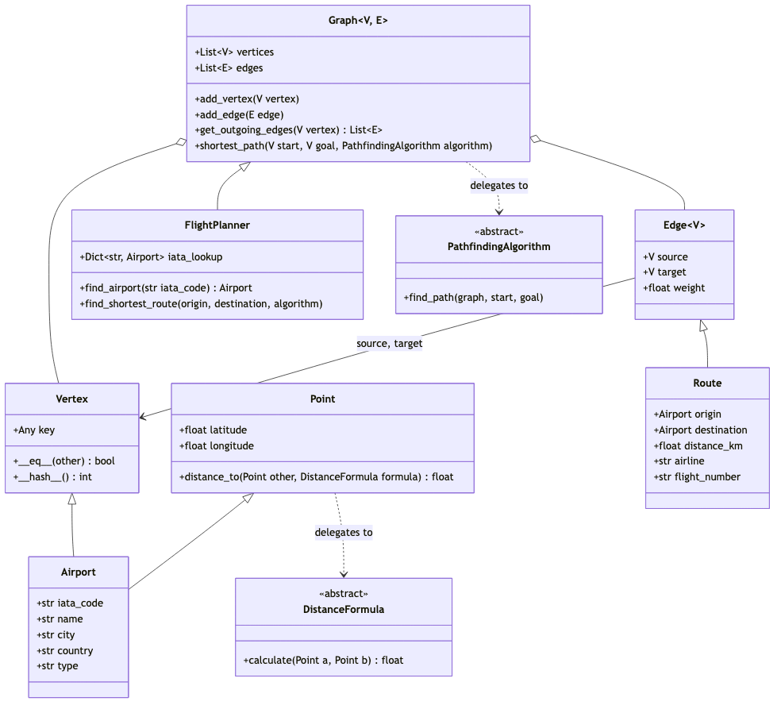

# 3. Graph Construction and Data Structures

This term project required the building of graphs using Airport and Route
information to then apply alogorithms to the graph. The algorithms
them selves rely strictly on *edges* and *vertexes* which are then
aggregated with a container: the *graph*. This chapter is describes
how these software components where built; the class-by-class reference is
[Appendix B](13-appendix-b-data-structures.md).

One approach would have been tightly couple to the domain that
was to be used by dispensing with the abstraction of edges and vertexes
and use their respective domain equivalents data *airports* and *routes*.

A concious decision was made to use derivation by first establishing the key
abstractions: edge and vertex and then inheriting this behavior as
the domain classes.

This approach allows the ability to create other domains that where
graph searching can be used.

## 3.1 The Four Layers of the Design

For this a project a Python package was created: `flight_plan`.

Below is summary of this package the details of which are
futher enumerated in appendix B.

| Layer | Holds | Knows nothing about |
|---|---|---|
| `core/` | `Vertex`, `Edge`, `Graph[V, E]` | airports, distance, algorithms |
| `geo/` | `Point`, `DistanceFormula`, `Haversine`, `Vincenty` | graphs |
| `pathfinding/` | `Dijkstra`, `BFS`, `AStar`, `SearchResult` | airports; reads only "which edges leave this vertex" and "what does an edge cost" |
| `flights/` | `Airport`, `Route`, `FlightPlanner` | — the only layer where the word *airport* appears |

The `flights` layer uses the top three layers which enables the ability
to apply graph searches to other problems that are NOT a flight network at all.
An example of which is shown below:

```python
>>> from flight_planner import Vertex, Edge, Graph, Dijkstra
>>> g = Graph()
>>> cities = {name: Vertex(name) for name in ['Portland', 'Boise', 'Reno']}
>>> g.add_edge(Edge(cities['Portland'], cities['Boise'], weight=690))
>>> g.add_edge(Edge(cities['Boise'], cities['Reno'], weight=680))
>>> g.add_edge(Edge(cities['Portland'], cities['Reno'], weight=1450))
>>> cost, legs = g.shortest_path(cities['Portland'], cities['Reno'], Dijkstra())
>>> cost
1370.0
>>> legs
[Edge('Portland' -> 'Boise', weight=690.0), Edge('Boise' -> 'Reno', weight=680.0)]
```

Those are road distances between three cities. Dijkstra neither knows nor
cares, and prefers two hops totalling 1,370 to one direct leg of 1,450 —
which is the same shape of answer §7 reports for flights, on machinery that
contains no aviation.

## 3.2 Composition, against a named alternative



`FlightPlanner` permits the selection of the algorithm ar runtime which is exactly what §4.4's
 mode switch and §7's comparison both need. In the code snippet make note how the distance
 formula (`Haversine`) and search path algorithm (`Dijkstrat()`) are arguments rather than embedded which
 permits switching these components.


```python
graph.shortest_path(start, goal, Dijkstra())     # the graph is given an algorithm
point.distance_to(other, Haversine())            # the point is given a formula
AStar(haversine_heuristic())                     # the search is given a heuristic
```

This allows the experimenter the flexibilityto try out other search algorithms (BFS, A\*, etc)
with the nearly the same code.

This is in fact a well known behavioral software design pattern known as [Strategy pattern](https://en.wikipedia.org/wiki/Strategy_pattern)

<div class="deck-slide" id="why-the-layers-exist">

### The graph has never heard of an airport

<div class="cards two">

<div class="card figure">



<p class="caption">The core and flight layers. Solid arrows are inheritance; dotted arrows are a strategy being handed in.</p>

</div>

<div class="card">

<span class="pill bfs">Built from scratch</span>

**1,591 lines, no `heapq`.** `core/` digraph · `adt/` binary min-heap ·
`pathfinding/` three searches · `geo/` two geodesic formulas.

<span class="pill">Composition, not inheritance</span>

**Behaviour is passed in.** `graph.shortest_path(a, b, Dijkstra())` — adding
an algorithm never changes `Graph`. The rejected alternative — `Graph`
deriving *from* Dijkstra — forces every graph to carry every algorithm.

</div>

</div>

</div>

## 3.3 `Airport` is a `Vertex` that is also a `Point`

`Airport` is the one class in the project with two parents, and it is worth
saying why that is composition's exception rather than its contradiction. An
airport has to answer two unrelated questions — *what is adjacent to me?*, which
is a graph question, and *where am I?*, which is a geographic one. Inheriting
both is how it answers both without a graph layer that knows about latitude:

```python
class Airport(Vertex, Point):
```

`Route(Edge[Airport])` is a flight leg whose `weight` is `distance_km`, plus the
domain fields — airline, flight number, codeshare flag, stops, equipment.
`FlightPlanner(Graph[Airport, Route])` adds exactly two things to the generic
graph: an IATA-code index, and the convenience wrappers §4.4 describes.

**Identity is the IATA code, and nothing else.** `Airport.__hash__` and
`__eq__` read only `iata_code`, which is what makes `BOS` one vertex however
many times the loader encounters it. It also produces one sharp edge, recorded
here because §5 tests it rather than fixing it:

```python
>>> catalog_bos = planner.find_airport('BOS')
>>> (catalog_bos.latitude, catalog_bos.longitude)
(42.36197, -71.0079)
>>> Airport('BOS') == catalog_bos          # equal, despite knowing no coordinates
True
>>> (Airport('BOS').latitude, Airport('BOS').longitude)
(0.0, 0.0)
```

## 3.4 Adjacency list, and what the alternative would cost

The graph representation models airports and flight routes using an adjacency
list rather than an adjacency matrix. Because global air route networks
are inherently sparse—connecting thousands of airports through only
a tiny fraction of all theoretically possible direct pairs—an adjacency
matrix would waste vast amounts of memory storing non-existent connections
and incur unnecessary overhead during neighbor lookups.

By implementing an adjacency list keyed by airport, the system stores only
actual flight legs (`Route`) originating from each airport (`Airport`).
This structure aligns memory consumption directly with active routes, ensuring
optimal traversal speeds and efficient neighbor iteration for pathfinding
routines like A* and Dijkstra.

<div class="deck-slide" id="adjacency-list">

### Why an adjacency list, in numbers

<div class="cards">

<div class="card">

<span class="pill">What it is</span>

### `Dict[V, List[E]]`

Per airport, only the routes that exist. **One method is the entire traversal
interface:**

```python
graph.get_outgoing_edges(vertex)
```

That is all three searches ever ask for — which is why they run unchanged on a
graph of road distances.

</div>

<div class="card">

<span class="pill warn">What a matrix would cost</span>

### 11,468,382 cells for 36,717 facts

The network uses **0.32%** of the ordered pairs available to it, so a matrix
would spend **over 99.6% of itself recording the absence of a route** — and
pay twice, in the zeros it stores and the row scan that reads past them.

</div>

<div class="card">

<span class="pill dijkstra">What a matrix could not do at all</span>

### ORD (Chicago)→ATL (Atlanta) has 20 rows

**29,615 of 66,332 routes run parallel** to another on the same pair. One cell
has nowhere to put twenty airlines.

A NetworkX mirror built as a `DiGraph` silently discards exactly those 29,615
— which is how §5 caught it.

</div>

</div>

</div>

## 3.5 Missing, duplicate and degenerate data

* **Missing identity or coordinates (dropped early):** Usable airports require a 3-character IATA code and valid coordinates (§2.3). Filtering before graph construction ensures `Airport` never holds null coordinates, allowing `Point` and heuristic calculations to assume valid floats.
* **False null strings (cast to string):** `CsvRecordLoader` casts `TEXT_COLUMNS` to `str` to stop pandas from parsing `"NA"` as `NaN`. This preserves continent values for North America and country codes for Namibia across 303 rows.
* **Duplicates (handled by level):**
* *Airports:* Collapsed via `drop_duplicates(subset="iata_code")` because multiple rows for the same code represent one physical airport.
* *Routes:* Retained. All 29,615 parallel edges represent real, distinct services stored in the adjacency list.


* **Self-loops (retained):** Exactly one survives cleaning:
```
IL0016  IL  PKN->PKN  0.0 km  Iskandar Airport (ID)

```

Because relaxation requires a strictly lower cost ($<$, §4.2), traversing `PKN->PKN` at cost `0.0` is never an improvement, leaving pathfinding unaffected:
```
PKN->SIN BFS       cost=2.0    legs=2  expanded=58  PKN->CGK->SIN
PKN->SIN Dijkstra  cost=1327.0 legs=4  expanded=49  PKN->KTG->PNK->KCH->SIN
PKN->SIN A*        cost=1327.0 legs=4  expanded=5   PKN->KTG->PNK->KCH->SIN

```

Retaining this edge satisfies the project specification requiring the graph structure to handle cyclic and duplicate edges with the data

