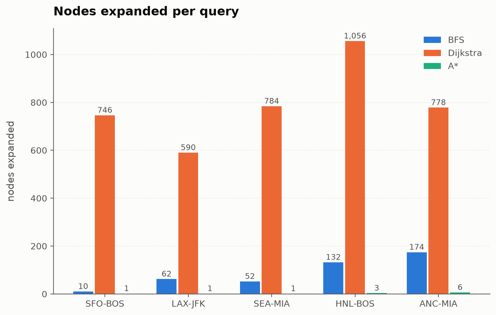
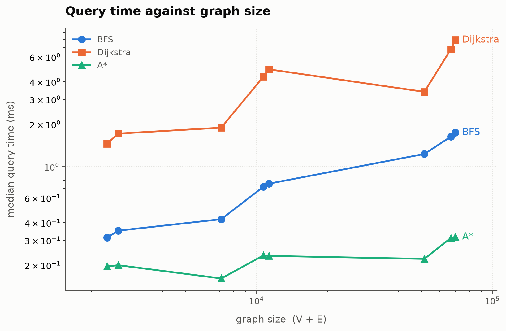

# 7. Empirical Evaluation

## 7.1 Methodology

Everything in this section comes from `experiments/search-cost/`, whose
`results.json` is committed alongside the notebook that produced it. The data is
a verified snapshot — if a byte of it changes, the notebook raises rather than
quietly producing different numbers.

| | |
|---|---|
| Snapshot | `2026-09-11-bb90a8` — 3,387 airports / 66,332 routes, no narrowing criteria |
| Query set | SFO–BOS, LAX–JFK, SEA–MIA, HNL–BOS, ANC–MIA — long-haul pairs, per the problem statement |
| Repeats | 15 per measurement, after one discarded warm-up call; **median** reported, which is robust to GC pauses in a way the mean is not |
| Timing | `time.perf_counter()` around the search only. The graph is built once *outside* the timed region, and no observer is attached while timing |
| Heuristic | `haversine_heuristic()` — memoized, and the same heuristic the validation experiments use. See the disclosure below |
| Size series | Eight narrowings of the world network, 2,329 to 69,719 V + E — a 30× span |
| CPU | Apple M2 Pro, 10 cores |
| Software | Python 3.12.12, macOS 26.6.2 (arm64) |

Four methodological points that materially affect whether the numbers mean
anything:

- **The x-axis is V + E, not airport count.** The two do not move together: the
  US large-airport network has 94 airports but 7,005 routes, while Delta's has
  352 airports and 1,977 routes. Ordering by airports produces a curve that
  crosses itself. V + E is also the term in O((V + E) log V).
- **The same five queries run at every size.** Every airport in the query set
  survives all eight narrowings, which is asserted by a test. Had a pair
  vanished partway down the series, the curve would be comparing different
  questions at different sizes.
- **A\*'s heuristic is memoized, and its cache is warm.** The heuristic caches
  great-circle distances by coordinate, and the discarded warm-up call fills
  that cache before the fifteen timed runs begin. This flatters A\* relative to
  a cold-cache measurement — by 7% to 20% on this series — and it is stated
  here rather than buried because the reader cannot infer it from the numbers.
  It is nevertheless the configuration being claimed: memoization is what the
  library does by default, and it is what `networkx-parity` and
  `astar-consistency` also measure, so the three experiments are comparable.
  Note the caching cannot change *which* airports A\* expands, only how quickly
  it evaluates them — the nodes-expanded results in §7.2 are unaffected.
- **Which results are portable, and which are not.** Nodes expanded, the
  distances, and the growth exponents are properties of the algorithms and
  reproduce on any machine — across three consecutive runs the exponents moved
  by at most 0.01. The absolute millisecond figures are properties of the
  machine above and should not be compared against a run on different hardware.
  Re-executing the notebook in Google Colab is the cheapest way for a reader to
  reproduce the timings on a stated, selectable configuration; the workload is
  single-threaded pure Python, so a GPU runtime changes nothing.

## 7.2 Nodes expanded: informed against uninformed search

| Query | BFS | Dijkstra | A\* | Dijkstra (km) | A\* (km) | A\* saving |
|---|---|---|---|---|---|---|
| SFO–BOS | 10 | 746 | **1** | 4341.022 | 4341.022 | 746× |
| LAX–JFK | 62 | 590 | **1** | 3974.164 | 3974.164 | 590× |
| SEA–MIA | 52 | 784 | **1** | 4379.358 | 4379.358 | 784× |
| HNL–BOS | 132 | 1,056 | **3** | 8192.794 | 8192.794 | 352× |
| ANC–MIA | 174 | 778 | **6** | 6459.622 | 6459.622 | 130× |

**A\* returned exactly Dijkstra's distance on all five queries — to the last
decimal place — while expanding 130× to 784× fewer airports.** That is the
project's central claim, measured rather than asserted.

### A\* pays for the same answer with 130× to 784× less search

| Query | BFS | Dijkstra | A\* | A\* saving |
|---|---|---|---|---|
| SFO–BOS | 10 | 746 | **1** | 746× |
| LAX–JFK | 62 | 590 | **1** | 590× |
| SEA–MIA | 52 | 784 | **1** | 784× |
| HNL–BOS | 132 | 1,056 | **3** | 352× |
| ANC–MIA | 174 | 778 | **6** | 130× |

0.000 km
difference between A\* and Dijkstra's distance, on all five queries

Measured, not asserted: `experiments/search-cost/results.json`, world snapshot `2026-09-11-bb90a8`.

## 7.3 Runtime

| Narrowing | V + E | BFS (ms) | Dijkstra (ms) | A\* (ms) |
|---|---|---|---|---|
| `airline DL` | 2,329 | 0.338 | 1.592 | 0.177 |
| `airline UA` | 2,597 | 0.353 | 1.857 | 0.159 |
| US large | 7,099 | 0.442 | 1.986 | 0.147 |
| US large+medium | 10,710 | 0.755 | 4.218 | 0.203 |
| US all | 11,315 | 0.742 | 5.029 | 0.210 |
| large | 51,536 | 1.205 | 3.610 | 0.188 |
| large+medium | 66,761 | 1.777 | 7.348 | 0.290 |
| world | 69,719 | 1.860 | 8.837 | 0.284 |

A\* is the fastest algorithm at every one of the eight sizes, and on the full
network it answers the same question as Dijkstra **31× faster**.

## 7.4 Runtime against input size

Log-log axes, so a power law appears as a straight line whose slope is the
growth exponent (§6.6). The ordering never changes across the whole 30× range:
A\* is **9× to 31× faster than Dijkstra** and **1.9× to 6.6× faster than BFS**,
with the gap widening as the graph grows. Those are ratios between series
measured in the same run on the same machine, so unlike the absolute
milliseconds they survive being re-run elsewhere.

## 7.5 Discussion

**Does A\* expand fewer nodes while returning the same answer? Yes,
unambiguously** — §7.2. The heuristic's admissibility guarantees the answers
match, and the measurement confirms the guarantee held on real data rather than
only in the proof.

Three findings complicate the simple story, and all three are more interesting
than the headline:

**BFS is not uniformly more expensive than Dijkstra.** It expands far fewer
nodes on every query here (10 against 746 on SFO–BOS) because it stops at the
first route it finds. But it answers a *different question*: fewest stops, not
shortest distance. Its "cost" column is a hop count, not kilometres, which is
why §7.2 reports Dijkstra's and A\*'s distances and not BFS's. On the 94-airport US
slice (snapshot `2026-09-12-3e4f9d`) the pair BOI–CHS shows the trade cleanly:

| Algorithm | Expanded | Route | Legs | Distance |
|---|---|---|---|---|
| BFS | 86 | BOI→ORD→CHS | 2 | 3,531.4 km |
| Dijkstra | 69 | BOI→DEN→BNA→CHS | 3 | 3,376.0 km |

BFS did *more* work than Dijkstra and returned a route 155 km longer — while
still being correct, because it was asked for the fewest stops and it found
them. Neither algorithm dominates, and the two are not comparable on a single
axis.

**A\* pushes far more than it expands.** On SFO–BOS it expands 1 airport but
pushes 105 entries onto the heap. Its saving is concentrated in expansions —
the expensive operation, since each one touches every outgoing route of an
airport — and not in heap traffic. Reporting only nodes expanded would overstate
the result; `nodes_pushed` is what makes the honest version visible.

**Dijkstra's runtime is not monotonic in graph size.** It drops from 4.898 ms at
11,315 V + E to 3.391 ms at 51,536 — a graph 4.6× larger answered 1.4× faster.
The `large` narrowing holds 50,474 routes among only 1,062 airports, so the query
pairs sit one or two hops apart and Dijkstra settles fewer airports before
reaching the goal. **Runtime tracks airports settled, not graph size** — the
same conclusion §6.6 reaches from the exponents, arrived at independently.

## 7.6 What this evaluation does not show

- **Worst-case behaviour.** Every query here succeeds and terminates early. An
  unreachable destination is the expensive case, because the search must exhaust
  the reachable component before answering; it is handled and tested, but it is
  not in this benchmark.
- **Behaviour on a different graph shape.** The airline network is small-world:
  dense hubs, short paths, high clustering. A sparse or grid-like graph would
  put A\*'s heuristic under real pressure, and these exponents would not carry
  over.
- **Comparability of absolute timings.** See §7.1.
- **Comparability with NetworkX's timings.** NetworkX's `shortest_path`
  runs a *bidirectional* search, so of the three algorithms only the A\*
  row compares like with like — see
  [results-networkx-parity.md](15-appendix-d-networkx-parity.md).
