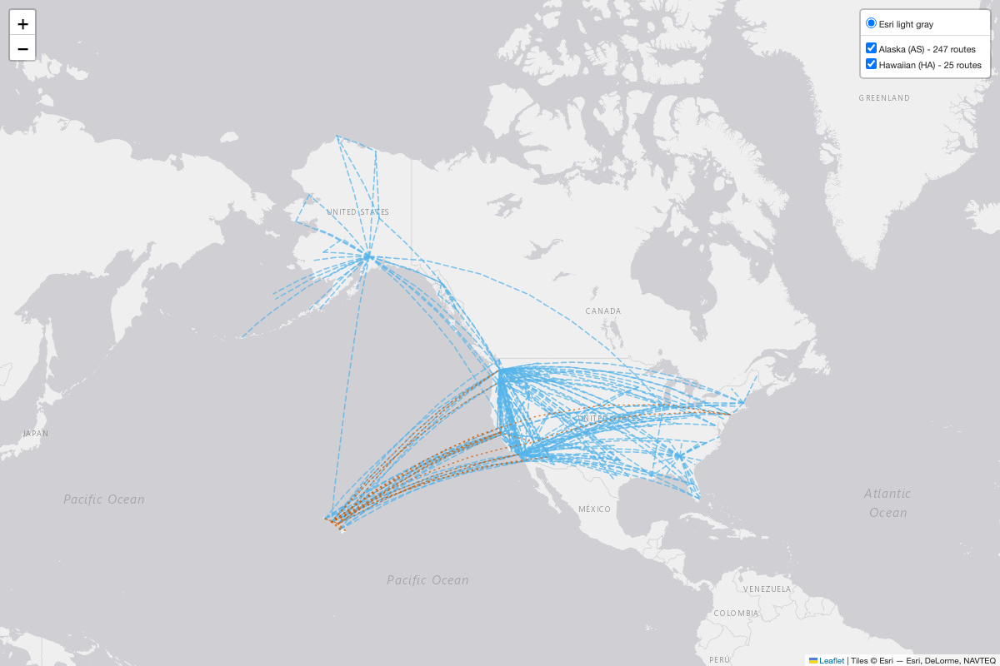

# 8. Visualization

§7 compares the algorithms in a table of numbers, and for two of the three
query pairs the table is enough. For the third it is not. `SYD→JFK` is answered
by BFS and Dijkstra in **the same two legs**, so nothing in the hop column
distinguishes them — and yet the answers are 7,057 km apart, because the two
itineraries leave Sydney in opposite directions. No column in §7 says that. A
map does.

So the visualization work is not decoration on a finished result. It is the
only representation in which one of the project's findings is legible at all.

`flight_planner.viz` is 1,401 lines in nine modules, built on **folium for the
map, pyproj for the geometry, and Playwright for the screenshot** — all three
imported lazily, inside the method that needs them, so a reader who only wants
the graph library never installs a browser. All three sit in the `notebooks`
or `dev` dependency groups; the published wheel still depends on `pandas` and
nothing else (§3).

## 8.1 What an answer looks like

The comparison the chapter exists to draw: `HNL→BDL`, both algorithms on one
map, each route its own toggleable layer.


The picture makes the trade concrete in a way the numbers do not: BFS's
two-leg itinerary is a longer *line*, visibly bending south to Atlanta before
turning back up the coast, while Dijkstra's three-leg route runs closer to the
great circle it is trying to approximate. Fewest stops and shortest distance
are different questions, and here that difference has a shape.

`experiments/route-map` records three pairs, each chosen to make a different
point:

| Pair | Dijkstra | BFS | The point |
|---|---|---|---|
| `HNL–BDL` | 8,071.5 km, 3 legs | 8,616.2 km, 2 legs | The ordinary trade: one fewer stop costs **544.7 km** |
| `ANC–PVD` | 5,876.9 km, 3 legs | 7,497.2 km, 2 legs | The widest gap found — one stop for **1,620.3 km** |
| `SYD–JFK` | 16,035.3 km, 2 legs | 23,092.6 km, 2 legs | **Same leg count, 7,057.3 km apart.** Hops cannot explain it |

That last row is the one §5.4 predicted. The parity sweep found BFS returning a
different-but-equally-short itinerary from NetworkX on 58 of 200 pairs, because
"fewest stops" does not name a single route when several exist. `SYD–JFK` is
what that ambiguity costs when the tie is broken badly: Dijkstra goes east
through Los Angeles, BFS goes west through Abu Dhabi, both in two legs, and one
is 44% longer.

## 8.2 Great circles, not straight lines

A `PolyLine` between two coordinate pairs draws as a straight line in Web
Mercator. That is neither the path an aircraft flies nor the distance
`Route.distance_km` reports — so drawing it straight would put a picture next
to a number that contradicts it. Appendix C makes this argument for distance;
a map has to make it too.

`viz.Geodesic` interpolates along the great circle with pyproj's `Geod.npts`
and returns the intermediate points. Every curve in this chapter's figures is
that, not styling.

Six interpolated segments is the default, and the reason is measured rather
than chosen: at the line weight the context network is drawn with, 6 segments
is indistinguishable from 24 and less than half the file size (§8.4).

## 8.3 The antimeridian, and the framing problem underneath it

`Geod.npts` returns longitudes normalized into [−180, 180]. A route crossing
the dateline therefore yields a coordinate list that jumps from `−179` to
`+179`, and Leaflet draws a line straight back across the entire map:


This is not hypothetical, and it is not rare. The committed world snapshot
holds **647 route rows — 137 distinct airport pairs — whose shorter great
circle crosses the antimeridian.** Any map of this network hits the bug 137
times.

The fix is to **unwrap rather than normalize**: when consecutive longitudes
differ by more than 180°, keep adding or subtracting 360° so the sequence stays
continuous. `AKL→LAX` at ten interpolated points, before and after:

```
naive:      174.8  -176.0  -168.0  -160.9  -154.3  -147.9  -141.4  -134.5  -127.0  -118.4
unwrapped:  174.8   184.0   192.0   199.1   205.7   212.1   218.6   225.5   233.0   241.6
```

Past +180 and still ascending — one continuous line east across the Pacific,
which is what Leaflet needs.

**And that creates a second problem, which is really the same one.** Unwrapped
geometry lives *outside* [−180, 180]: the `AKL→LAX` line is drawn from 174.8°
to 241.6°. A bounding box built from the two airports' own coordinates spans
−118.4 to 174.8 — the wrong way round the planet, and a box that **does not
contain the line it was asked to frame.** So `MapLayer` reports the points it
actually drew and `RouteMap` frames itself on those, rather than letting the
map infer bounds from airport positions. Markers are shifted into the same copy
of the world as the lines for the same reason: a marker left at its raw
longitude renders one globe to the west and falls off the edge of the frame.


One more subtlety appears only on multi-leg routes, and it is why that frame is
135° wide instead of 404°. `Geodesic` unwraps *within* a leg, starting from
that leg's own origin — so `SYD→LAX` ends at 241.6° while `LAX→JFK` begins
again at its raw −118.4°, a 360° discontinuity between two legs that are each
individually correct. `PathLayer` shifts each leg into the copy of the world
the previous one finished in. Without that, the map frames itself over more
than a full globe and zooms out past the route it was drawing.

Only Dijkstra is drawn in that figure, deliberately. BFS's `SYD→AUH→JFK` leaves
in the opposite direction, so drawn together the two answers span the whole
planet and neither is legible. That is also why §8.1's table has to carry the
`SYD–JFK` row in numbers *and* the chapter has to explain it in prose: it is
the one comparison that defeats both a table and a single picture.

`tests/flight_planner/viz/test_geodesic.py` pins all of it — the unwrapping,
the westward case, the 647 rows and 137 pairs in the snapshot, and that **every
one of those 647 routes draws with zero discontinuities.** The bug is invisible
on a US-only network, which is exactly why it needs a test rather than a
careful author.

## 8.4 Making the whole network drawable

The route layer that sits *under* an answer is the expensive part. Drawing all
66,332 routes the obvious way — one `folium.PolyLine` each, 24 interpolated
points — produces **109.21 MB of saved HTML in 33.1 s.** `NetworkLayer` brings
that to 4.61 MB in 1.2 s, and **none of the saving comes from drawing less:**

| Change | Saved HTML |
|---|---|
| One `PolyLine` per route, 24 segments | 109.21 MB |
| One `GeoJson` layer instead of N `PolyLine`s | 38.82 MB |
| 6 interpolated segments instead of 24 | 17.92 MB |
| One feature per **airport pair** instead of per route row | **4.61 MB** |

Each row is a different kind of saving. The first is about how folium emits
JavaScript — one statement per `PolyLine` against one blob of coordinates for a
`GeoJson` layer. The second is resolution nobody can see at continental zoom,
along with rounding coordinates to three decimal places (about 110 m).

**The last row is the interesting one, and it is not really an optimisation.**
66,332 route rows are only **18,814 distinct airport pairs** (§2.5's
undirected count), because the route table is keyed by flight number and a busy
city pair appears three or four times. Drawing per row paints the same line
over itself — paying in file size every time, *and* darkening it on screen in a
way that misrepresents the geometry. Collapsing to distinct pairs is a 3.9×
saving and the more truthful picture. The fast path and the correct path are
the same path, which does not happen often enough to pass up.

**The context layer is off by default**, and that is an honesty decision rather
than a size one. Drawn underneath, the whole network buries the answer it sits
beneath — [`docs/visualization.md`](../visualization.md#four-conclusions-the-helper-should-bake-in)
carries the side-by-side. `NetworkLayer.show()` returns `False`
unconditionally — the caller cannot forget to switch it off — so the context
sits in the layer control unchecked, and a reader turns it on when their
question becomes "what else was available?".

## 8.5 Colour, and what it has to survive

Three algorithms need three colours, and the constraints are more numerous than
they look. `viz.palette` assigns colour **by what a series means, never by the
order it was added**, so adding a fourth algorithm cannot repaint the three
already on screen.

The slots are validated rather than picked: worst all-pairs colour-vision-
deficiency ΔE of **9.4**, normal-vision ΔE **20.9**, and contrast at least
**3:1** against the surface they are drawn on. Each series also carries a
**shape** — circle, square, triangle — because identity has to survive
greyscale printing, and a reader with a monochrome printer is not an edge case
for a submitted report.

Those three figures came from an external colour-vision checker, so unlike
every other number in this report they cannot be re-derived from the
repository. §8.7 implements the equivalent measurement in committed code for
the twelve-carrier palette; doing the same for these three slots is worthwhile
and has not been done.

Two decisions worth stating:

- **The palette is shared with `experiments/search-cost/plots.py`.** A chart
  and a map on the same slide therefore agree about which colour is Dijkstra.
  Two modules each picking "blue for the first series" is how a deck ends up
  contradicting itself between adjacent figures.
- **Scenery is not drawn from a series slot.** The context network and the
  airport markers are grey, not a fourth categorical colour, because they are
  scenery rather than findings — given a series colour they would compete with
  an algorithm for meaning.

There are two palettes, stepped per surface rather than flipped: the report and
GitHub get the light one, the reveal.js deck the dark one.

## 8.6 Getting an interactive map into a static report

A Leaflet map cannot go into a PDF, and this report is a PDF. There is also a
committed-notebook rule in the way: `tests/experiments/test_committed.py`
asserts that **every committed experiment notebook carries no stored output**,
so an inline map is gone the moment the kernel dies. Anything the report or the
deck cites has to be written to a file.

`viz.MapExporter` does that — HTML always, and PNG through a headless
Playwright browser. It is a separate class from `RouteMap` because the two need
different things: HTML needs only folium, while the screenshot needs a browser
that is a repository tool rather than part of the package contract. Both
figures in this chapter were written by `experiments/route-map/explore.ipynb`
through that exporter, to `docs/images/` and `slides/images/` in the same call.

**One trap found by fetching a tile rather than reading documentation.** The
prototype's first basemap default was CartoDB positron, which under folium
0.20.0 renders **`API KEY REQUIRED` stamped diagonally across every tile.**
Stadia returns HTTP 401 for every tile request. So `RouteMap` refuses the whole
`cartodb` / `carto` / `stadia` / `stamen` family **at construction**, rather
than letting a watermarked map be discovered after it is already in a report.

The detail worth carrying forward: **`xyzservices` reports the Stadia providers
as requiring no token.** Provider metadata said the tiles were free; fetching
one said otherwise. Only `OpenStreetMap` works without a key, and it is the
default.

That conclusion is correct and incomplete, and §8.7 is where it broke. A key is
not the only thing a basemap can require. OSM's tile usage policy also demands
that requests be **attributable**, enforced on the `Referer` header — so OSM
serves real tiles to a page loaded over HTTP and a `403 / Access blocked`
notice to the same file opened at a `file://` URL. The notice arrives as **HTTP
200 with a PNG body**, so the check that caught the Carto watermark — counting
failed tile requests — would have reported perfect success.

## 8.7 One layer per airline

Everything above draws an *answer* — a route a search returned. The layer
machinery is built for N independent toggleable layers, and drawing two or
three algorithms never asked it for more than that.
`experiments/us-route-map` asks for thirteen, and changes what the reader is
for: instead of reading a conclusion, they filter until they find one.

The slice is the United States including Alaska, Hawaii and Puerto Rico —
`--country US PR --airport-type large medium`, 473 airports and 10,363 route
rows collapsing to 2,688 distinct airport pairs. Twelve carriers get a layer
each, all switched on; a thirteenth holds the 132 pairs none of them serves,
so the layers partition the network rather than merely overlapping it. The
twelve layers draw 4,515 arcs between them, more than the 2,688 pairs, because
a pair flown by two carriers is drawn once per layer — which is exactly what
makes switching one off informative.

Two things about the slice are easy to get wrong and both would be invisible
in the output. **Puerto Rico is `PR`, not `US`** under ISO 3166-1, so
narrowing on `US` alone silently drops every Caribbean arc. And **large
airports alone leave Alaska as essentially Anchorage**, discarding the bush
network that is most of the reason to draw Alaska at all.


Nothing in the package had to be rewritten for this. The filter is
`Catalog.airline()`, which already existed; the drawing is one `NetworkLayer`
per carrier, which already batched and deduplicated; the checkboxes are the
same `LayerControl` §8.4 attaches. `NetworkLayer` gained a colour, a dash
pattern and a say in its own visibility, all defaulted so every existing
caller is unaffected.

**The carrier palette had to be measured, and measuring it refuted the first
design.** §8.5 needs three colours; this needs twelve, and twelve
simultaneously distinguishable hues do not exist under the colour-vision
constraint. So identity became hue *and* stroke — the same construction that
gives each algorithm a shape as well as a colour. The first attempt used six
hues over two dash patterns, and under tritanopia the three warm hues collapse:
vermillion against reddish purple measured ΔE **0.9**. Those were Delta and US
Airways, two legacy majors, both solid. The failure is structural rather than
unlucky, because six hues over two dash classes puts every hue in every class.
Four hues over three dash classes fixes it by construction — each class holds
each hue exactly once — and the worst same-stroke pair then measures ΔE
**19.6** on the light surface and **30.4** on the dark, across normal vision
and three simulated dichromacies.

Same-stroke is the set that matters: two carriers a reader must separate by
colour alone are two carriers drawn with the same dash. Unlike the ΔE figures
in §8.5, which came from an external checker, this measurement is committed
code — `palette_contrast()` in the experiment's `plots.py`, tested against
properties any correct dichromat simulation must have — so it can be re-run
and disputed.


The deliverable is the interactive file, `docs/maps/us-route-map.html`, and it
is committed — the only generated artifact in this repository that is. A map
whose point is toggling twelve carriers cannot be delivered as a still, and one
that needs a running Jupyter kernel to open is not delivered at all. It ships
under a size bound the test suite enforces, at 2.01 MB.

**Committing it is also what exposed the basemap defect above.** Opened the way
a reader opens it — double-clicked, so `file://`, so no `Referer` — every OSM
tile came back as a block notice, with the arcs and the filtering working
perfectly on top. It survived review because every check had gone through a
local HTTP server: the interactive map was verified over localhost, and the
stills are rendered by Playwright over localhost. Both send a `Referer`. The
one access path never tested was the only one the deliverable exists for.

The map now uses Esri's World Light Gray Base, which needs neither a key nor a
referer — verified from a `file://` URL, 35 tile requests, all 200 — and which
as a desaturated canvas also stops the basemap competing with the arcs. What is
*not* verified is whether Esri's terms permit this use outside their own SDKs;
it demonstrably works, which is a different claim from being allowed. §8.6's
lesson was that provider metadata is no substitute for fetching a tile, and the
converse holds equally: fetching a tile is no substitute for reading the terms.

Filtering was verified in a browser rather than assumed: on load the document
carries 4,518 SVG paths, which is the 4,515 arcs plus three map decorations;
unchecking every carrier but Hawaiian leaves 28; re-checking Alaska gives 275,
which is 247 + 25 + 3.

<div class="deck-slide" id="route-map">

### What an answer looks like

<div class="cards two figure-left">

<div class="card figure">


<p class="caption">`HNL→BDL`. BFS in blue, two legs via Atlanta. Dijkstra in orange, three legs via Salt Lake City and Detroit — and 544.7 km shorter.</p>

</div>

<div class="card">

<span class="pill warn">Where the table fails</span>

### SYD (Sydney)→JFK (New York City), same 2 legs

Dijkstra east via Los Angeles: **16,035 km**. BFS west via Abu Dhabi:
**23,092 km**.

**7,057 km apart at identical hop counts** — the two answers leave Sydney in
opposite directions, and no column in §7 says so.

<span class="pill dijkstra">The geometry is not free</span>

### 647 routes cross the dateline

Normalized longitudes jump ±180° and Leaflet draws the line back across the
map. Unwrap, then frame on the *drawn* points rather than the airports.

</div>

</div>

<p class="footnote">`experiments/route-map`, world snapshot `2026-09-11-bb90a8`; folium 0.20.0, pyproj 3.7.2.</p>

</div>

<div class="deck-slide" id="us-route-map">

### One layer per airline

<div class="cards two figure-left">

<div class="card figure">



<p class="caption">Two of thirteen layers. Alaska in sky blue dashed — the bush network out of Anchorage; Hawaiian in vermillion dotted — the Honolulu corridor. Neither shows on a lower-48 map.</p>

</div>

<div class="card">

<span class="pill dijkstra">The reader does the asking</span>

### 13 layers, 4,515 arcs, every one switchable

US + Puerto Rico, large and medium airports: **473 airports, 2,688 pairs**.
Twelve carriers get a layer, a thirteenth holds the **132** pairs they miss —
so the layers *partition* the network.

Checked in a browser: 4,515 arcs on load, **25** when only Hawaiian stays
checked.

<span class="pill warn">Measuring beat designing</span>

### Six hues failed at ΔE 0.9

Twelve distinguishable hues do not exist for a colour-blind reader, so
identity is hue **and** stroke. Six hues over two dashes put Delta and US
Airways at **ΔE 0.9** under tritanopia — both solid, indistinguishable.

Four hues over three dashes, and the worst same-stroke pair measures
**19.6**.

</div>

</div>

<p class="footnote">`experiments/us-route-map`, snapshot `2026-09-15-8054eb`; interactive map at `docs/maps/us-route-map.html`, 2.01 MB.</p>

</div>
