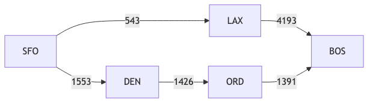

# Appendix B. Data Structures and the Public API

This is the reference for the classes §3 argues about. §3 carries the
argument; this carries the surface.

`Airport`, `Route` and `FlightPlanner` are the three classes you use when you
ask this project a question about flying. None of them builds a graph itself.
Each one is a thin, flight-specific layer sitting on a general-purpose class
that does the real work — `Vertex`, `Edge` and `Graph` — and almost everything
in this document follows from that one arrangement.

This is a guided tour of those six classes, plus `Point`, the small class that
gives an airport its location. For each pair: what the general class promises,
what the flight-specific class adds, and what you gain by keeping them apart.
Every example below was run at the Python prompt and pasted back exactly as it
came out.

**What this does not cover.** `Snapshot`, `Catalog` and `Experiment` — the
parts that keep results repeatable — are described in
[Experiments](../experiments.md) and built step by step in the
[Tutorial](../tutorial.md). The distance formulas are in [Distance
Formulas](14-appendix-c-distance-formulas.md), the search algorithms in [report
§4](04-algorithms.md), and a shorter summary of the design ships
inside the package itself as [the
README](../../src/flight_planner/README.md). Runnable versions of much of what
follows are listed in [Demos](../demos.md).

**Trying it yourself.** `uv run python` from a clone is all you need — these
examples load no data files. See [Setup
§3](../setup.md#3-create-the-environment-and-install-dependencies) if you do not
have the environment yet, or [Running the examples](#running-the-examples) at
the end of this document for Jupyter and Google Colab.

## Why the split exists

A flight network is a graph: airports are the points, flights are the arrows
between them, and "cheapest itinerary" is a shortest-path question. That only
helps if the graph part is written as a graph — on its own, with no airports
in it.

It is tempting to skip that step and write one `FlightPlanner` class that holds
the airports, stores their coordinates, and implements Dijkstra's algorithm as
a method. It works. It is also a dead end. The search cannot be reused for
anything that is not an airport. You cannot swap in a different search without
editing the class. And every new question — fewest stops? cheapest? — makes
that same file bigger.

So the package splits along the line instead:

- **`core/`** — `Vertex`, `Edge`, `Graph[V, E]`. A plain graph whose arrows
  have direction and cost, and which has never heard of an airport.
- **`geo/`** — `Point` and the `DistanceFormula` family. Geography, with no
  graph in it at all.
- **`pathfinding/`** — `Dijkstra`, `BFS`, `AStar`. Searches that read only two
  things: which arrows leave a point, and what each arrow costs.
- **`flights/`** — `Airport`, `Route`, `FlightPlanner`. The flight layer, and
  the only place the word "airport" appears.

The bottom layer really does stand on its own. Nothing in it imports
`flights`:

```python
>>> from flight_planner import Vertex, Edge, Graph, Dijkstra
>>> g = Graph()
>>> cities = {name: Vertex(name) for name in ['Portland', 'Boise', 'Reno']}
>>> g.add_edge(Edge(cities['Portland'], cities['Boise'], weight=690))
>>> g.add_edge(Edge(cities['Boise'], cities['Reno'], weight=680))
>>> g.add_edge(Edge(cities['Portland'], cities['Reno'], weight=1450))
>>> cost, legs = g.shortest_path(cities['Portland'], cities['Reno'], Dijkstra())
>>> cost
1370.0
>>> legs
[Edge('Portland' -> 'Boise', weight=690.0), Edge('Boise' -> 'Reno', weight=680.0)]
```

Those are road distances between three cities, and Dijkstra neither knows nor
cares. Flights are just one of the things this machinery can be used for.

## The hierarchy

The class diagram is in [§3.2](03-graph-construction.md), which makes the
argument it illustrates. Read it as three pairs of inheritance and two
hand-offs. A solid arrow means
"is a kind of": an `Airport` is a kind of `Vertex`. The dotted arrows mean
something different. `Graph` is *given* a search algorithm to use, and `Point`
is *given* a distance formula to use, rather than inheriting either one. The
[package README](../../src/flight_planner/README.md#why-composition-over-inheritance)
argues that choice in full. Here is what it buys: adding a new algorithm never
changes `Graph`, and adding a new formula never changes `Point`.

## `Airport`: a `Vertex` that is also a `Point`

`Airport` is the only class here with two parents, because it has to answer
two unrelated questions. *Which point on the graph is this?* — that comes from
`Vertex`. *Where on Earth is it?* — that comes from `Point`.

An **IATA code** is the three-letter name for an airport that you see on a
boarding pass or a baggage tag: `SFO`, `BOS`, `LHR`. The International Air
Transport Association assigns them, and this project uses one as an airport's
identity.

```python
>>> from flight_planner import Airport, Vertex, Point
>>> [cls.__name__ for cls in Airport.__mro__]
['Airport', 'Vertex', 'Point', 'object']
>>> sfo = Airport('sfo ', name='San Francisco International Airport',
...               city='San Francisco', country='US',
...               latitude=37.6188, longitude=-122.3756)
>>> sfo
Airport('SFO', city='San Francisco', lat=37.6188, lon=-122.3756)
>>> sfo.key
'SFO'
>>> isinstance(sfo, Vertex), isinstance(sfo, Point)
(True, True)
```

Two things in that session matter.

**The code is tidied up on the way in.** `'sfo '` became `'SFO'`, and that one
value became both the `iata_code` and the `Vertex.key`. An airport has exactly
one identity, and it is its IATA code. Codes work well for this because they
are short, they do not change, and they do not repeat. In this project's
processed data all 3,387 airports have one, and no two share the same code.
The loader discards any source row that lacks one.

**`Vertex` is named first, on purpose.** The second line of the session shows
the order Python searches the parent classes: `Airport`, then `Vertex`, then
`Point`. Putting `Vertex` first means its rules for "are these two the same?"
win over anything `Point` might say, so two `Airport`s count as the same
airport when their codes match — whatever else differs:

```python
>>> Airport('SFO') == Airport('SFO', city='Somewhere else',
...                           latitude=0.0, longitude=0.0)
True
>>> Airport.__eq__ is Vertex.__eq__
True
```

`Graph` depends on that, because it stores its points as dictionary keys.
`Point` helps by not defining those rules at all. It is built to be combined
with another class, so it deliberately stays out of the identity question —
which is exactly what makes it safe to combine.

Only `iata_code` is required. Every other field defaults to empty: `name`,
`city`, `country`, `region`, `continent`, `elevation_ft`, `type`, `icao_code`,
`has_scheduled_service`, `is_international` and `wikipedia_link`. So an airport
you build by hand stays one line long, while airports loaded from the dataset
can still carry everything [Data §5](../data.md#5-the-processed-dataset) lists.

None of these take part in identity. They are there for reporting, and for
narrowing a `Catalog` down to the scope you want. `country`, `type` and
`is_international` each have a matching filter — see [Experiments
§5](../experiments.md#narrowing). The rest you filter on yourself, as [Experiments
§3](../experiments.md#finding-airports-airlines-and-codes) does by city, region
and continent.

`icao_code` is the four-letter code used in air-traffic control — `KSFO`,
`KBOS`, `EGLL` — kept for matching against other datasets. Both codes are in
the [Glossary](18-appendix-g-glossary.md#aviation).

The `Point` half adds one method, and it takes the formula as an argument:

```python
>>> bos = Airport('BOS', city='Boston', latitude=42.3643, longitude=-71.0052)
>>> round(sfo.distance_to(bos), 1)
4341.3
```

That is `Haversine` by default. Passing `Vincenty()`, or a formula of your
own, changes the number and nothing else. See [Distance
Formulas](14-appendix-c-distance-formulas.md).

## `Route`: an `Edge` whose weight is domain data

`Route` is an `Edge` between two `Airport`s with flight words layered on top.
`Edge` supplies `source`, `target` and `weight`. `Route` renames the first two
and gives the third a unit.

```python
>>> from flight_planner import Airport, Route, Edge
>>> sfo = Airport('SFO', city='San Francisco',
...               latitude=37.6188, longitude=-122.3756)
>>> lax = Airport('LAX', city='Los Angeles',
...               latitude=33.9416, longitude=-118.4085)
>>> leg = Route(sfo, lax, distance_km=543.0, airline='UA',
...             flight_number='UA1876')
>>> leg
Route(SFO -> LAX, 543.0 km, flight='UA1876')
>>> isinstance(leg, Edge)
True
>>> leg.origin is leg.source, leg.destination is leg.target
(True, True)
>>> leg.distance_km == leg.weight
True
```

`origin`, `destination` and `distance_km` are simply other names for data that
`Edge` already holds — not second copies of it. They let flight code read like
flight code, while the search algorithms carry on reading `source`, `target`
and `weight`. That renaming is the whole trick that lets a single Dijkstra
serve both this and the road graph in [Why the split
exists](#why-the-split-exists).

**The weight is given to you, not worked out.** It is easy to assume
`distance_km` is whatever `distance_to` would return for the same two
airports. It is not:

```python
>>> round(sfo.distance_to(lax), 1)
543.3
>>> leg.weight
543.0
```

The first is an estimate of the straight-line distance between two
coordinates. The second is what the data said. They are close here, and they
need not be — real flight paths are not straight lines. This is the
distinction to hold on to. A `DistanceFormula` only ever *estimates* the gap
between two `Point`s, and is used to steer A\*'s guessing. `Edge.weight` is
the real cost that each algorithm adds up along a path. They are two separate
things, and [Extending it](#extending-it) changes one without touching the
other.

**Arrows point one way.** `Route(sfo, lax, ...)` creates SFO (San Francisco)→LAX (Los Angeles) and nothing
else. A return flight is a second `Route`.

## `FlightPlanner`: a `Graph` with an index

`FlightPlanner` is a `Graph` of `Airport`s and `Route`s, plus one addition: a
lookup table from IATA code to `Airport`, kept current as airports are added.
It lets you ask questions using codes rather than object references.

The network below has no direct SFO (San Francisco)–BOS (Boston) service, and two ways across the
country:



```python
>>> from flight_planner import (Airport, Route, FlightPlanner,
...                             Dijkstra, BFS, AStar, Graph)
>>> COORDS = {'SFO': (37.6188, -122.3756), 'LAX': (33.9416, -118.4085),
...           'DEN': (39.8561, -104.6737), 'ORD': (41.9742, -87.9073),
...           'BOS': (42.3643, -71.0052)}
>>> airports = {code: Airport(code, latitude=lat, longitude=lon)
...             for code, (lat, lon) in COORDS.items()}
>>> LEGS = [('SFO', 'LAX', 543), ('LAX', 'BOS', 4193),
...         ('SFO', 'DEN', 1553), ('DEN', 'ORD', 1426),
...         ('ORD', 'BOS', 1391)]
>>> planner = FlightPlanner()
>>> for origin, destination, km in LEGS:
...     planner.add_edge(Route(airports[origin], airports[destination], km))
...
>>> isinstance(planner, Graph)
True
>>> len(planner.vertices), len(planner.edges)
(5, 5)
```

Five `add_edge` calls produced five airports without a single `add_vertex`:
`add_edge` registers either end of an arrow if it has not seen it before.
Adding the same airport twice does nothing and leaves its arrows alone, so
building a network from a list of flights needs no bookkeeping.

The index is what `FlightPlanner` adds, and it tidies up its argument the same
way `Airport` does:

```python
>>> planner.find_airport('sfo ')
Airport('SFO', city='', lat=37.6188, lon=-122.3756)
>>> sorted(planner.iata_lookup)
['BOS', 'DEN', 'LAX', 'ORD', 'SFO']
```

`iata_lookup` hands back a copy, so the network cannot be rearranged behind
the planner's back.

Moving through the network goes through exactly one method, and direction
shows up plainly in it:

```python
>>> planner.get_outgoing_edges(airports['SFO'])
[Route(SFO -> LAX, 543.0 km, flight=''), Route(SFO -> DEN, 1553.0 km, flight='')]
>>> planner.get_outgoing_edges(airports['BOS'])
[]
```

`get_outgoing_edges` is the entire interface the algorithms see. No departures
from BOS (Boston) were declared, so nothing leaves BOS (Boston).

### Asking for a route

`find_shortest_route` turns codes into airports, then hands the work to a
search algorithm. Leave the algorithm out and you get `Dijkstra`:

```python
>>> cost, legs = planner.find_shortest_route('SFO', 'BOS')
>>> cost
4370.0
>>> [leg.destination.iata_code for leg in legs]
['DEN', 'ORD', 'BOS']
```

You always get back a total cost and a list of flights. The flights are the
itinerary in order, so they are the answer, and the cost is their weights
added up.

Ask the same question with a different algorithm and you get a different
answer:

```python
>>> cost, legs = planner.find_shortest_route('SFO', 'BOS', algorithm=BFS())
>>> cost, [leg.destination.iata_code for leg in legs]
(2.0, ['LAX', 'BOS'])
>>> sum(leg.distance_km for leg in legs)
4736.0
```

Two flights instead of three, but 4,736 km instead of 4,370. Notice that BFS
reports a cost of `2.0`: it counts flights and ignores `weight` entirely,
which is why the distance had to be added up separately. That difference is
the subject of the [Tutorial](../tutorial.md), which turns it into a recorded
experiment.

A\* answers the same question as Dijkstra but reaches it faster, provided you
give it a distance guess that never overestimates — the property called
*admissibility*. Do not write that guess by hand: which formula you pick decides
whether the answer is guaranteed optimal, and `haversine_heuristic()` is the one
that is safe here. [Appendix C](14-appendix-c-distance-formulas.md) explains
why, and why the more accurate `Vincenty` is the *worse* choice.

```python
>>> from flight_planner import haversine_heuristic
>>> cost, legs = planner.find_shortest_route('SFO', 'BOS',
...                                          algorithm=AStar(haversine_heuristic()))
>>> cost, [leg.destination.iata_code for leg in legs]
(4370.0, ['DEN', 'ORD', 'BOS'])
```

The agreement is the point: the guess changed how the search ran, not what it
found. [Report §4.3](04-algorithms.md) covers why — it turns on the
heuristic being *consistent* and not merely admissible — and
`src/demos/astar_example.py` wraps the guess in `Memoized` so it is not
recalculated.

### The three edge cases

```python
>>> planner.find_shortest_route('BOS', 'SFO')
(inf, [])
>>> planner.find_shortest_route('SFO', 'SFO')
(0.0, [])
>>> planner.find_shortest_route('SFO', 'JFK')
Traceback (most recent call last):
  ...
ValueError: Airport with IATA code 'JFK' not found in the graph.
```

No route at all gives `(inf, [])` — westbound really is impossible here, since
every flight was declared eastbound. Asking for a route from an airport to
itself gives `(0.0, [])`. An airport that is not in the network raises an
error instead of quietly returning an empty path, which keeps "no such
airport" separate from "no such route".

<div class="deck-slide" id="core-api">

### The API the algorithms actually see

<div class="cards two figure-left">

<div class="card figure">



<p class="caption">Five-airport example network — the API below built and queried on exactly this graph.</p>

</div>

<div class="card">

<span class="pill">Building</span>

**`add_edge` is enough.** `planner.add_edge(Route(sfo, den, 1553))` registers
either endpoint it has not seen; adding an airport twice is a no-op.

<span class="pill dijkstra">Asking</span>

**The algorithm is an argument.** `planner.search_route("HNL", "BDL", BFS())`
— Dijkstra by default. A fourth algorithm needs no change to `FlightPlanner`.

<span class="pill astar">Answering</span>

**`SearchResult`, not a number.** `cost` · `path` · `nodes_expanded` ·
`nodes_pushed` · `peak_frontier` · a `unit` tag. Boundaries tested:
unreachable → `(inf, [])`, unknown code → **`AirportNotFoundError`**.

</div>

</div>

</div>

## Where the data comes from

Nothing above loaded a file. There are three ways to fill a planner with real
data, in increasing order of care:

| Source | Call | When |
|---|---|---|
| Built by hand | `add_edge` in a loop, as above | Examples, tests, anything you want visible on one screen |
| Processed CSVs | `load_flight_planner(airports_path, routes_path)` from `flight_planner.loaders` | Exploring the current dataset |
| A frozen snapshot | `catalog.planner()` | Anything whose numbers you intend to keep |

The second reads files that `make flight_network` rewrites. They are fine for
looking around, but not for a number you plan to quote later.

The third is the repeatable route, and is the subject of
[Experiments](../experiments.md#materializing-turning-a-catalog-into-a-graph). A
`Catalog` narrows checked, frozen data down to the scope you want, then hands
back a `FlightPlanner` holding exactly that scope's airports and routes. What
comes back is the same class described here, so everything in
the [`FlightPlanner`
section](#flightplanner-a-graph-with-an-index) still applies to it. That is the
hand-off point: this document stops at the graph, and that one picks up at
the data.

`src/demos/loader_example.py` shows the CSV route;
`src/demos/catalog_example.py` shows the snapshot route.

## Extending it

The split described in [Why the split
exists](#why-the-split-exists) pays off when you need
something the package does not already include. In each case below you write a
new class outside the package and hand it to library code that never changes.

**A different kind of weight.** `Edge.weight` means whatever you decide it
means. To weigh flights by time rather than distance, base the new class on
`Edge` rather than on `Route`. A class based on `Route` would inherit the name
`distance_km`, which would then be handing back hours. Every algorithm keeps
working either way, because they only ever read `weight`:

```python
>>> from flight_planner import Airport, Edge, Graph, Dijkstra
>>> class TimedRoute(Edge[Airport]):
...     def __init__(self, origin, destination, duration_hours):
...         super().__init__(source=origin, target=destination,
...                          weight=duration_hours)
...     @property
...     def duration_hours(self):
...         return self.weight
...
>>> sfo = Airport('SFO', latitude=37.6188, longitude=-122.3756)
>>> den = Airport('DEN', latitude=39.8561, longitude=-104.6737)
>>> bos = Airport('BOS', latitude=42.3643, longitude=-71.0052)
>>> timetable: Graph[Airport, TimedRoute] = Graph()
>>> timetable.add_edge(TimedRoute(sfo, den, duration_hours=2.75))
>>> timetable.add_edge(TimedRoute(den, bos, duration_hours=4.0))
>>> timetable.add_edge(TimedRoute(sfo, bos, duration_hours=7.25))
>>> hours, legs = timetable.shortest_path(sfo, bos, Dijkstra())
>>> hours
6.75
>>> [leg.duration_hours for leg in legs]
[2.75, 4.0]
```

"Shortest" now means fastest, and Dijkstra was not changed, rebuilt, or
configured. `src/demos/custom_edge_weight_example.py` is the runnable version.

**A different search algorithm.** Write a `search` method on a class based on
`PathfindingAlgorithm`, returning a `SearchResult`. It works with
`Graph.shortest_path` and `FlightPlanner.find_shortest_route` straight away,
because both take the algorithm as an argument — and `find_path` comes for
free, inherited from the base class, which just reads `cost` and `path` off
what you return.

**A different distance formula.** Write a `calculate` method on a class based
on `DistanceFormula`, and pass it wherever `Haversine` would go.
`geo/formula.py` names four more that fit the same interface and are not
implemented — Spherical Law of Cosines, Equirectangular, Karney's, and UTM
projection — and `src/demos/custom_distance_formula_example.py` implements one
of them.

**A different subject entirely.** `Vertex`, `Edge` and `Graph` are not about
flying, as [Why the split exists](#why-the-split-exists) showed. Nothing in `core/` or
`pathfinding/` has to change to route something that is not an aircraft.

## Running the examples

Every example in this document runs against the installed package and needs no
data files. From a clone, `uv run python` is enough — see [Setup
§3](../setup.md#3-create-the-environment-and-install-dependencies).

Nothing here is specific to the Python prompt: the same code works in a
notebook cell, without the `>>>` markers. What changes is how the package gets
installed, which depends on where the notebook runs:

| Where | What you do | Instructions |
|---|---|---|
| Jupyter, in a clone | `uv sync --group notebooks`, then `uv run jupyter lab` — a plain `uv sync` does not install JupyterLab | [Setup §5](../setup.md#5-jupyter-notebooks) |
| Google Colab | Clone the repository into `/content/`, then `pip install` that directory — a plain install, *not* `pip install -e` | [Setup §6](../setup.md#6-google-colab) |

Read [Setup §6](../setup.md#6-google-colab) before your first Colab session
rather than after. It explains the three things that most often go wrong:

- an editable install (`pip install -e`) reports success, then fails to import
- re-running a `git clone` cell quietly installs a stale copy
- nothing needs a runtime restart

It also gives a `sys.path` fallback that skips installing altogether.
[Experiments §2](../experiments.md#2-three-pieces) shows the same table with the
non-notebook cases alongside.

This repository's own notebooks are in `notebooks/`. If a notebook in a clone
cannot find the package, its kernel is pointing somewhere other than `.venv`;
[Setup §5](../setup.md#5-jupyter-notebooks) has the command that fixes it.

## See also

- [Package design](../../src/flight_planner/README.md) — the design summary that
  ships inside the package, including the full argument for handing classes
  their behaviour instead of inheriting it, and the testing layout.
- [Experiments](../experiments.md) — snapshots, catalogs, and how a
  `FlightPlanner` gets built from data that cannot change quietly.
- [Tutorial](../tutorial.md) — one experiment from start to finish, comparing the
  BFS and Dijkstra answers in [`FlightPlanner`: a `Graph` with an
  index](#flightplanner-a-graph-with-an-index).
- [Demos](../demos.md) — runnable versions of most of the above.
- [Distance Formulas](14-appendix-c-distance-formulas.md) — the geodesic layer in depth.
- [Report §4 *Algorithms*](04-algorithms.md) — the three searches, the
  min-heap, and the admissibility argument.
- [Glossary](18-appendix-g-glossary.md) — aviation and graph terms.
