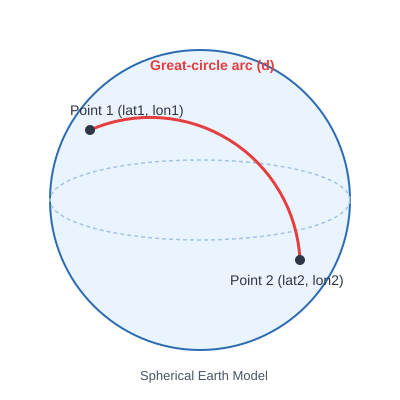
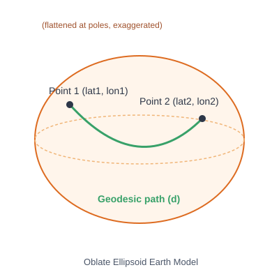
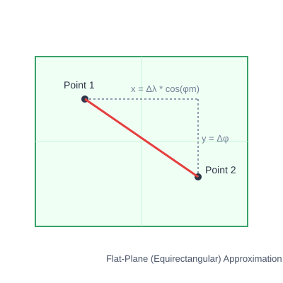
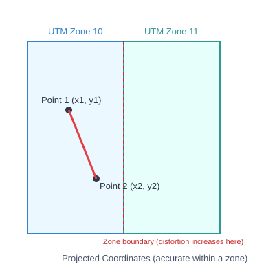

# Appendix C. Distance Formulas

The major methods for computing the distance between two latitude/longitude
pairs, with the mathematics behind each. §2.3's edge weights and §4.3's
heuristic both use the first of them, haversine; §4.3's argument turns on how it
compares with the fourth, Vincenty.


## 1. Haversine Formula

**Model:** Spherical Earth
**Type:** Great-circle distance

The haversine formula computes the shortest distance between two points on the surface
of a sphere, given their longitudes and latitudes.

### Formula

```
a = sin²(Δφ/2) + cos(φ1) * cos(φ2) * sin²(Δλ/2)
c = 2 * atan2(√a, √(1−a))
d = R * c
```

Where:
- φ1, φ2 = latitudes of point 1 and point 2, in radians
- Δφ = φ2 − φ1
- Δλ = λ2 − λ1 (difference in longitude, in radians)
- R = Earth's radius (mean radius ≈ 6,371 kilometers)
- d = distance between the two points

**Pros:** Numerically stable for very small distances, simple to implement.
**Cons:** Assumes a perfect sphere, so it has about 0.5 percent error due to Earth's actual ellipsoidal shape.


## 2. Spherical Law of Cosines

**Model:** Spherical Earth
**Type:** Great-circle distance

Mathematically equivalent to haversine, derived directly from spherical trigonometry.

### Formula

```
d = R * acos( sin(φ1) * sin(φ2) + cos(φ1) * cos(φ2) * cos(Δλ) )
```

Where the variables are the same as above.

**Pros:** Simple, direct formula.
**Cons:** Suffers from floating-point rounding errors when distances are very small (points close together), because it involves taking the arccosine of a value very close to 1.


## 3. Equirectangular Approximation

**Model:** Flat-plane approximation
**Type:** Approximate planar distance

This method treats latitude and longitude as if they were flat x-y coordinates on a
plane, applying a correction factor for the shrinking of longitude lines toward the poles.

### Formula

```
x = Δλ * cos(φm)
y = Δφ
d = R * √(x² + y²)
```

Where:
- φm = mean latitude = (φ1 + φ2) / 2
- Δλ, Δφ = differences in longitude and latitude, in radians

**Pros:** Very fast to compute, good for short distances (city-scale).
**Cons:** Accuracy degrades quickly over long distances since it ignores Earth's curvature.


## 4. Vincenty's Formula

**Model:** Oblate ellipsoid (more realistic Earth shape)
**Type:** Geodesic distance (iterative)

Vincenty's formulae compute distances on an ellipsoidal model of the Earth (flattened
at the poles), solving the "inverse geodesic problem" through iteration.

### Formula (simplified overview)

Given the ellipsoid's semi-major axis `a`, semi-minor axis `b`, and flattening `f`:

```
U1 = atan((1−f) * tan(φ1))
U2 = atan((1−f) * tan(φ2))
L = λ2 − λ1

Iterate to solve for λ (the difference in longitude on the auxiliary sphere):

sin(σ) = √[ (cos(U2) * sin(λ))² + (cos(U1) * sin(U2) − sin(U1) * cos(U2) * cos(λ))² ]
cos(σ) = sin(U1) * sin(U2) + cos(U1) * cos(U2) * cos(λ)
σ = atan2(sin(σ), cos(σ))

... (additional correction terms for ellipsoidal flattening) ...

d = b * A * (σ − Δσ)
```

Where `A` and `Δσ` are correction terms accounting for ellipsoidal flattening, computed
during iteration until convergence (typically within a few iterations).

**Pros:** Accurate to within millimeters for most points on Earth.
**Cons:** Computationally heavier due to iteration; can fail to converge for nearly antipodal points (points almost exactly opposite each other on the globe).


## 5. Karney's Algorithm (Geodesic Method)

**Model:** Oblate ellipsoid
**Type:** Geodesic distance (closed-form / series-based, non-iterative failure modes)

Developed by Charles Karney to resolve Vincenty's convergence failures, this method uses
series expansions and is implemented in libraries such as GeographicLib. It is considered
the modern gold standard for ellipsoidal geodesic calculations.

### Formula (conceptual)

Karney's method solves the same geodesic inverse problem as Vincenty, but uses:

```
Series expansions in terms of the third flattening parameter n:
n = (a − b) / (a + b)
```

These series converge reliably everywhere, including near-antipodal points, avoiding
the convergence failures of Vincenty's iterative approach. The full derivation involves
elliptic integrals evaluated via series expansion, making it more mathematically
involved than Vincenty's but robust in all cases.

**Pros:** Highly accurate everywhere on Earth, including edge cases; well-optimized.
**Cons:** More complex to implement from scratch (most users rely on a library like GeographicLib).


## 6. Projected Coordinate Methods (e.g., UTM)

**Model:** Flattened projection of the ellipsoid onto a plane
**Type:** Euclidean distance after projection

Instead of computing distance directly on the curved Earth, coordinates are first
converted into a projected coordinate system, such as Universal Transverse Mercator
(UTM), and then ordinary Euclidean distance is applied.

### Formula

After converting (φ, λ) to UTM easting/northing (x, y) via the UTM projection equations:

```
d = √[ (x2 − x1)² + (y2 − y1)² ]
```

**Pros:** Very fast and intuitive once projected; ideal for local/regional GIS work.
**Cons:** Only accurate within a single UTM zone; distortion increases significantly if points span multiple zones or are far apart.


## 7. Manhattan (Taxicab) Distance

**Model:** Flat-plane approximation
**Type:** Approximate planar distance, L1 norm

The Equirectangular method above with the L1 norm in place of L2: rather than the
straight-line hypotenuse, the sum of the two legs. It is the standard heuristic for
grid pathfinding, where movement is restricted to the axes and the sum of the legs
*is* the shortest path.

### Formula

```
x = Δλ * cos(φm)
y = Δφ
d = R * (|y| + |x|)
```

Where:
- φm = mean latitude = (φ1 + φ2) / 2
- Δλ, Δφ = differences in longitude and latitude, in radians, with Δλ folded to
  the short way round so an antimeridian pair is not measured going the long way

**Pros:** The cheapest of the formulas here, and as an A\* heuristic it steers the
search harder than any admissible estimate can, cutting expansions by about half
against great-circle distance on this project's graph.
**Cons:** It is not a distance on the sphere at all, and it **overestimates**. Since
`|x| + |y| ≥ √(x² + y²)`, it is never below the Equirectangular figure and so never
below the great-circle distance either. That makes it **inadmissible as an A\*
heuristic here**: measured over the world snapshot it exceeds its own edge weight on
66,331 of 66,332 edges, overestimating the median edge by a third, and A\* guided by
it returns a suboptimal route on 172 of 290 random pairs while reporting it as
optimal. `experiments/manhattan-heuristic` measures the trade in full;
`flight_planner.geo.Manhattan` implements it, and is committed as that measured
counterexample rather than as an option.

Note that this is the one method here whose problem is not accuracy. Vincenty is
*more* accurate than haversine and also breaks admissibility on this graph, for the
same underlying reason: the edge weights are haversine numbers, so only haversine
stands in the right relationship to them.


## Summary Table

| Method | Earth Model | Accuracy | Best Use Case |
|---|---|---|---|
| Haversine | Sphere | ~0.5% error | General purpose, short-to-medium distances |
| Spherical Law of Cosines | Sphere | ~0.5% error | Simpler alternative to haversine (large distances) |
| Equirectangular | Flat plane | Poor over long distances | Short distances, performance-critical applications |
| Vincenty | Ellipsoid | Millimeter-level | High-precision geodesy, most points on Earth |
| Karney (Geodesic) | Ellipsoid | Millimeter-level, all cases | Modern gold standard, handles edge cases |
| Projected (UTM) | Projected ellipsoid | High within zone | Local/regional GIS analysis |
| Manhattan (Taxicab) | Flat plane, L1 | Overestimates; not a spherical distance | Grid pathfinding. Inadmissible as an A\* heuristic here — see §7 |


## Python Implementations

Below are working Python implementations for each method described above.

### 1. Haversine Formula

```python
from math import radians, sin, cos, sqrt, atan2

def haversine(lat1, lon1, lat2, lon2, R=6371.0):
    phi1, phi2 = radians(lat1), radians(lat2)
    dphi = radians(lat2 - lat1)
    dlambda = radians(lon2 - lon1)

    a = sin(dphi / 2)**2 + cos(phi1) * cos(phi2) * sin(dlambda / 2)**2
    c = 2 * atan2(sqrt(a), sqrt(1 - a))
    return R * c
```

### 2. Spherical Law of Cosines

```python
from math import radians, sin, cos, acos

def spherical_law_of_cosines(lat1, lon1, lat2, lon2, R=6371.0):
    phi1, phi2 = radians(lat1), radians(lat2)
    dlambda = radians(lon2 - lon1)

    d = acos(sin(phi1) * sin(phi2) + cos(phi1) * cos(phi2) * cos(dlambda))
    return R * d
```

### 3. Equirectangular Approximation

```python
from math import radians, cos, sqrt

def equirectangular(lat1, lon1, lat2, lon2, R=6371.0):
    phi1, phi2 = radians(lat1), radians(lat2)
    phi_m = (phi1 + phi2) / 2
    dlambda = radians(lon2 - lon1)
    dphi = phi2 - phi1

    x = dlambda * cos(phi_m)
    y = dphi
    return R * sqrt(x**2 + y**2)
```

### 4. Vincenty's Formula

```python
from math import radians, sin, cos, tan, atan, atan2, sqrt, pi

def vincenty(lat1, lon1, lat2, lon2):
    # WGS-84 ellipsoid parameters
    a = 6378137.0
    f = 1 / 298.257223563
    b = (1 - f) * a

    L = radians(lon2 - lon1)
    U1 = atan((1 - f) * tan(radians(lat1)))
    U2 = atan((1 - f) * tan(radians(lat2)))
    sinU1, cosU1 = sin(U1), cos(U1)
    sinU2, cosU2 = sin(U2), cos(U2)

    lam = L
    for _ in range(1000):
        sin_lam, cos_lam = sin(lam), cos(lam)
        sin_sigma = sqrt((cosU2 * sin_lam)**2 +
                          (cosU1 * sinU2 - sinU1 * cosU2 * cos_lam)**2)
        if sin_sigma == 0:
            return 0.0  # coincident points
        cos_sigma = sinU1 * sinU2 + cosU1 * cosU2 * cos_lam
        sigma = atan2(sin_sigma, cos_sigma)
        sin_alpha = cosU1 * cosU2 * sin_lam / sin_sigma
        cos_sq_alpha = 1 - sin_alpha**2
        cos_2sigma_m = cos_sigma - 2 * sinU1 * sinU2 / cos_sq_alpha if cos_sq_alpha != 0 else 0
        C = f / 16 * cos_sq_alpha * (4 + f * (4 - 3 * cos_sq_alpha))
        lam_prev = lam
        lam = L + (1 - C) * f * sin_alpha * (
            sigma + C * sin_sigma * (cos_2sigma_m + C * cos_sigma *
                                      (-1 + 2 * cos_2sigma_m**2)))
        if abs(lam - lam_prev) < 1e-12:
            break

    u_sq = cos_sq_alpha * (a**2 - b**2) / b**2
    A = 1 + u_sq / 16384 * (4096 + u_sq * (-768 + u_sq * (320 - 175 * u_sq)))
    B = u_sq / 1024 * (256 + u_sq * (-128 + u_sq * (74 - 47 * u_sq)))
    delta_sigma = B * sin_sigma * (cos_2sigma_m + B / 4 * (
        cos_sigma * (-1 + 2 * cos_2sigma_m**2) - B / 6 * cos_2sigma_m *
        (-3 + 4 * sin_sigma**2) * (-3 + 4 * cos_2sigma_m**2)))

    s = b * A * (sigma - delta_sigma)
    return s / 1000.0  # convert meters to kilometers
```

### 5. Karney's Algorithm (Geodesic Method)

This one is best used via the well-tested `geographiclib` library rather than
implemented from scratch, since the series expansions are involved.

```python
# pip install geographiclib
from geographiclib.geodesic import Geodesic

def karney_geodesic(lat1, lon1, lat2, lon2):
    result = Geodesic.WGS84.Inverse(lat1, lon1, lat2, lon2)
    return result['s12'] / 1000.0  # meters to kilometers
```

### 6. Projected Coordinate Methods (UTM)

This uses the `utm` package to convert to UTM coordinates, then applies simple
Euclidean distance. Only valid when both points fall in the same UTM zone.

```python
# pip install utm
import utm
from math import sqrt

def utm_distance(lat1, lon1, lat2, lon2):
    x1, y1, zone1, band1 = utm.from_latlon(lat1, lon1)
    x2, y2, zone2, band2 = utm.from_latlon(lat2, lon2)

    if zone1 != zone2:
        raise ValueError("Points are in different UTM zones; result would be inaccurate.")

    d = sqrt((x2 - x1)**2 + (y2 - y1)**2)
    return d / 1000.0  # meters to kilometers
```


### 7. Manhattan (Taxicab) Distance

```python
from math import radians, cos

def manhattan(lat1, lon1, lat2, lon2, R=6371.0):
    phi1, phi2 = radians(lat1), radians(lat2)
    phi_m = (phi1 + phi2) / 2

    # Fold the longitude difference to the short way round, so a pair either
    # side of the antimeridian is not measured going the long way.
    dlon = abs(lon2 - lon1)
    dlambda = radians(min(dlon, 360.0 - dlon))
    dphi = phi2 - phi1

    return R * (abs(dphi) + abs(dlambda) * cos(phi_m))
```


## Example Usage

```python
lat1, lon1 = 37.3382, -121.8863   # San Jose, CA
lat2, lon2 = 34.0522, -118.2437   # Los Angeles, CA

print("Haversine:", haversine(lat1, lon1, lat2, lon2), "km")
print("Spherical Law of Cosines:", spherical_law_of_cosines(lat1, lon1, lat2, lon2), "km")
print("Equirectangular:", equirectangular(lat1, lon1, lat2, lon2), "km")
print("Vincenty:", vincenty(lat1, lon1, lat2, lon2), "km")
print("Karney:", karney_geodesic(lat1, lon1, lat2, lon2), "km")
print("Manhattan:", manhattan(lat1, lon1, lat2, lon2), "km")
```


## Diagrams

The following SVG diagrams illustrate the geometric concepts behind each method.
They are located in the `images/` subfolder alongside this file.

- `images/great_circle.svg` — illustrates the great-circle arc used by the
  Haversine formula and the Spherical Law of Cosines, on a spherical Earth model.
- `images/ellipsoid_geodesic.svg` — illustrates the geodesic path used by
  Vincenty's formula and Karney's algorithm, on an oblate ellipsoid Earth model.
- `images/equirectangular.svg` — illustrates the flat-plane approximation used
  by the Equirectangular method, showing the x/y projection and correction factor.
- `images/utm_projection.svg` — illustrates the projected coordinate approach
  (UTM), showing zone boundaries and where distortion increases.

To embed these in a rendered markdown report, reference them like so:

```markdown




```
